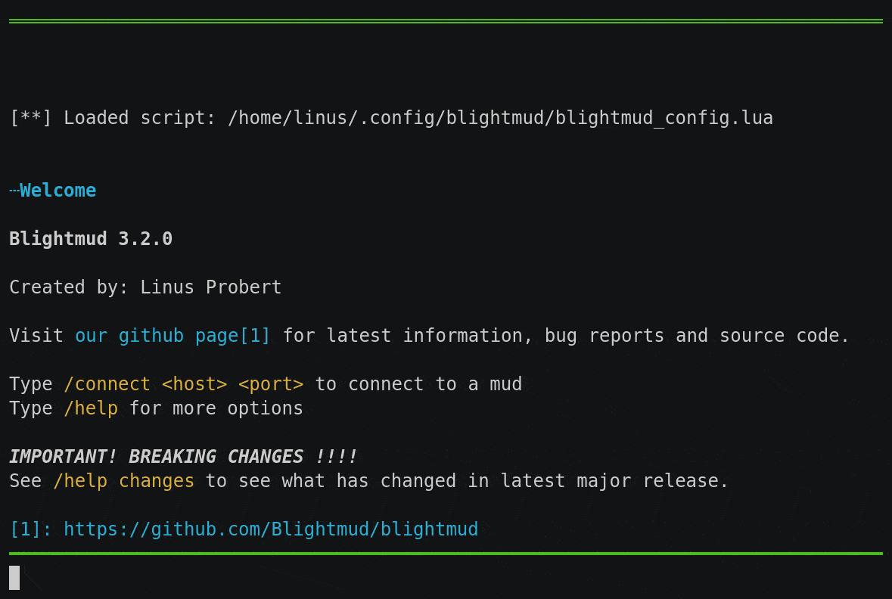

  

# Blightmud  : A mud client for the terminal

Blightmud has been a passion project of mine for some time. A big user of the
old but great [tinyfugue](http://tinyfugue.sourceforge.net/) I always wanted to
create my own similar mud client. Even though I don't play much muds these
days.

## The name?

The client is written in rust. Some navigating throught the thesaurus brought
me to the word **blight** and here we are.

## Features

- Completely terminal based (mac and linux)
- Telnet:
  - TLS connections
  - GMCP support
  - MSDP support
  - MCCP2 support (compress2)
- Lua scripting:
  - Output and sending
  - Aliases
  - Triggers
  - Timers
  - Customizing status bar
  - Persistent storage
  - Session storage
  - Keybindings
  - Audio playback (music/ambiance and sound effects)
  - Text-To-Speech
  - Mouse scrolling (experimental)
  - Plugins
  - Sockets (TCP connecting and sending only)
- Low resource and fast
- In client help and manuals
- Native Text-To-Speech functionality (optional compile)
- Text searching
- Tab completion
- Split view when scrolling
- Screen reader friendly mode

## Demo

## Compiling

- Install rust
- Run `cargo build` to compile
- Run `cargo run` to run

Dependencies include, openssl, alsa-libs and pkg-config
- Ubuntu    `apt install pkg-config libopenssl-dev libasound2-dev`
- Arch      `pacman -S pkgconf alsa-lib openssl`

### Compile with text-to-speech

- Install rust
- Run `cargo build --all-features` to compile
- Run `cargo run --all-features` to run

In order for this to build correctly you will need to install some additional
dev dependencies: **libclang** and **libspeechd**. Below are some installation
commands that might fit your system:

- Ubuntu    `apt install libclang-dev libspeechd-dev speech-dispatcher speech-dispatcher-espeak espeak`
- Arch      `pacman -S speech-dispatcher espeak`

## Installation

- **Ubuntu/Debian**      : Deb packages can be found on the releases page
- **Archlinux/Manjaro**  : Packages are available on AUR
- **Mac/Homebrew**       : We have a homebrew tap `brew tap Blightmud/blightmud` (intel only, if you're on Apple Silcon (darwin) compiling is the best option)
- **Other/Alternative**  : Download source and run `cargo install --path .` from the project root
- **Windows**            : No native windows support but Blightmud runs fine under WSL

## Support, questions and help

Join our [discord](https://discord.gg/qnxgUC5)

## Contributing

All contributions are welcome. Check out [contributing guidelines](CONTRIBUTING.md).

## Side notes

This is my first rust project that has actually grown a bit. Some things might
look silly but thanks to rust they should still be safe. Anywho. If you find
some antipattern where you have a better idea I'm more then happy to se the PR
and learn some more rustier ways.
